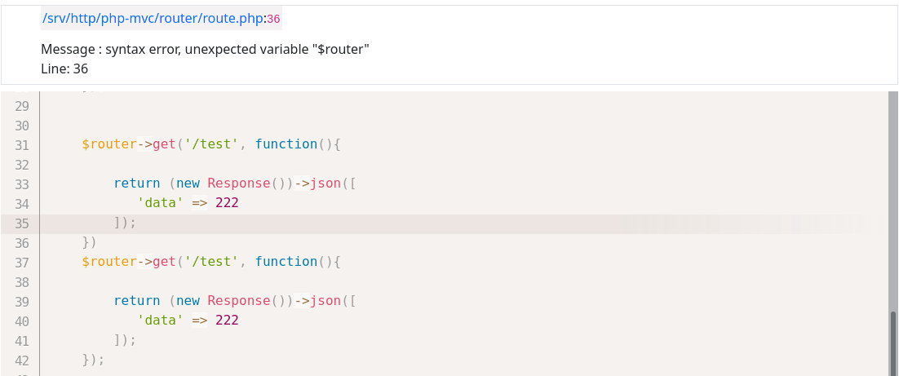

# PHP Exception View
It finds which file and line it is in by following the exceptions in PHP and shows you the codes of the relevant file and error.

Example:



# Install
```shell
    composer require ahmetbarut/php-exception
```

## Configure
My advice to you is to use it where all the exceptions occur, that is, where your application is running. This way you can see all exceptions.

```php
    use AhmetBarut\Exception\Init;

    try {
        // code...
    } catch (\Throwable $th) {

        $ex = new Init($th);
        $ex->run();
    }
```
...

